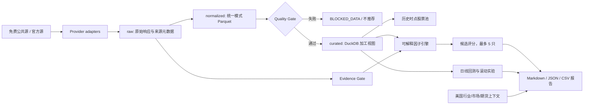

# 系统架构

## 设计目标

系统采用“程序负责数值、规则负责门禁、模型只解释文本”的边界。所有研究产物都能沿运行 ID 追溯到原始来源、抓取时间、数据日期、可知时间、内容哈希、质量报告、因子结果和证据 ID。任何必需依赖失败都会使本次运行进入 `BLOCKED_DATA`，下游不得继续。

## 数据流

## 分层与职责

### 数据提供者层

`providers/base.py` 定义统一请求、返回批次和注册表。提供者必须返回字段级溯源，且对每个失败项目显式记录错误。AkShare 适配 A 股日线；官方适配器覆盖 FRED、CFTC COT 和 SEC EDGAR。重试由统一有界策略控制，不允许递归或无限重试。

### 存储与质量层

- `raw`：保留外部响应、请求参数和采集元数据，与加工数据隔离。
- `normalized`：写入统一模式的 Parquet，生成可复算的数据批次清单。
- `curated`：通过质量门禁后写入 DuckDB，供股票池、因子、回测和报告读取。
- `quarantine`：承载失败或异常数据，绝不能被生产分析默认读取。

质量契约逐行检查模式、必填值、类型、完整性、有效日期/可知日期时效性、唯一性及必需数据域；同一数据域的多个未协调批次会直接阻断。失败报告包含 run ID、数据哈希、问题和阻断原因，不能通过重新抓取旧数据或后备样例绕过。

### 股票池与因子层

股票池规则来自 YAML，并以历史日期运行，避免只用今日成分产生幸存者偏差。因子模块各自声明公式、输入依赖和缺失值规则；财务与事件数据使用实际披露/可知时间。评分权重只来自 `config/factors.yaml`，结果包含原始值、标准化值和最终得分。

### 回测层

自定义日线引擎把订单日期解释为收盘信号日，只允许下一交易日开盘成交，并处理 A 股手数、T+1、停牌、涨跌停、无法成交、手续费、最低佣金、卖出印花税和滑点。交易状态字段缺失时阻断；持仓临时缺 bar 时使用已知最后收盘价估值，不把资产静默归零。所有输入按 `as_of` 和滚动窗口起止日期截断，成功与失败窗口都保留。Qlib 仅作为后续对照验证。

### Evidence Gate

证据按 A/B/C/D 分级：A/B 可成为核心证据；无 A/B 时需要至少两个相互独立的 C 级来源；D 级仅作线索。每条证据必须绑定 event ID 和 entity ID；模块按发布时间过滤未来不可知证据，区分发布时间和事件时间，识别转载/重复，要求反方搜索，并把独立反方证据计入催化惩罚。无法验证的重大事件不进入核心评分。

### 全球上下文与报告

美国行业、美国股市走势、FRED 宏观数据和 CFTC 期货持仓只形成上下文及风险说明，不改变 A 股候选数值评分，也不触发真实对冲。报告聚合数据完整性、市场环境、行业排名、候选、因子、正反证据、失效条件、历史信号和风险；无合格候选时明确“不推荐”。

## 安全边界

- 无券商接口、账户接口、委托或自动交易代码。
- 密钥不硬编码；生产路径不读取测试夹具。
- 语言模型不生成价格、成交量、财务、资金流、因子、排名或收益指标。
- 每个外部调用都有超时、限速和最大尝试次数。
- 数据门禁先于 Evidence Gate、因子、候选和报告推理。
- 每个下游 CLI 必须消费同一 run ID 的 PASS 门禁及数据哈希；门禁失败时只允许渲染错误一致的阻断报告。
